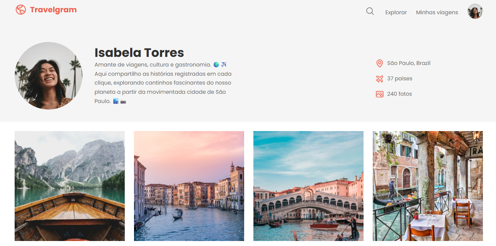

<h1 align="center"> Travelgram </h1>

  Uma página de perfil estilo rede social, focada em compartilhar momentos de viagens pelo mundo.

  <a href="#-tecnologias">Tecnologias</a>&nbsp;&nbsp;&nbsp;|&nbsp;&nbsp;&nbsp;
  <a href="#-projeto">Projeto</a>&nbsp;&nbsp;&nbsp;|&nbsp;&nbsp;&nbsp;
  <a href="#-layout">Layout</a>&nbsp;&nbsp;&nbsp;|&nbsp;&nbsp;&nbsp;
  <a href="#memo-licença">Licença</a>

  

 

  

## 🚀 Tecnologias

Esse projeto foi desenvolvido com foco em construção de layouts responsivos:

- HTML5 (Semântico)
- CSS3 

## 💻 Projeto

O **Travelgram** é uma página de perfil pessoal fictícia para amantes de viagens.
O objetivo principal foi criar uma galeria de imagens responsiva que se ajusta elegantemente a diferentes tamanhos de tela, mantendo a identidade visual.

Destaques do desenvolvimento:
- **Galeria em Grid:** Utilização de `display: flex` e `flex-wrap` para criar uma grade de fotos fluida que se adapta automaticamente.
- **Perfil Responsivo:** O cabeçalho com a foto de perfil e estatísticas muda de disposição (horizontal para vertical) em dispositivos móveis (`max-width: 480px`).
- **Ícones e Estilo:** Uso consistente de ícones SVG e uma paleta de cores definida via variáveis CSS (`--brand-color`, `--text-color`).

🔗 [Acesse o projeto online](https://miqueiassantoss.github.io/travelgram/)

## 📝 Licença

Esse projeto está sob a licença MIT.

---

  Feito por <a href="https://github.com/miqueiassantoss">Miqueias Santos</a>

